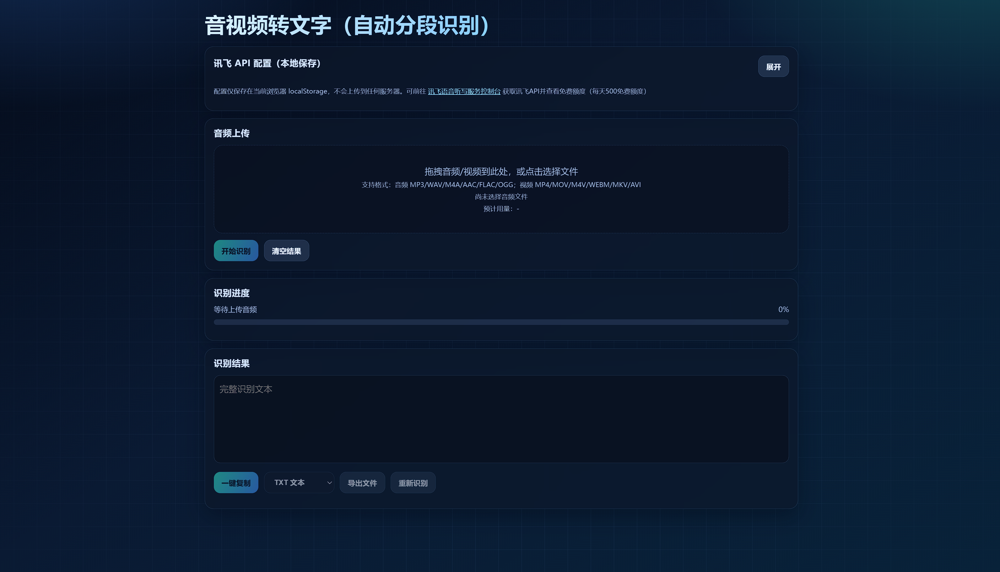

# 🎙️ 音视频转文字 & 音频分割工具

在线音视频转文字工具，支持自动分段、长音频处理，基于讯飞语音听写 API，**纯前端实现，无需后端服务器**。

## ✨ 功能特点

- 🎬 **音视频转文字** — 支持上传音频和视频文件，自动识别并转为文字
- ✂️ **智能分段** — 自动将长音频分段处理，突破单次识别时长限制
- 🔒 **隐私保护** — 纯前端处理，API Key 仅保存在浏览器 localStorage，不会上传到任何服务器
- 📱 **响应式设计** — 支持 PC 和移动端访问
- 🆓 **完全免费** — 代码开源，讯飞 API 每天提供 500 次免费额度

## 📸 截图

<div align="center">
  
</div>

## 🚀 快速开始

### 在线使用

直接访问在线演示地址：

👉 **[在线演示](https://zhuan.dlidli.wang/)**

### 本地运行

```bash
# 克隆仓库
git clone https://github.com/aiyoubucuoyou/voice-to-text-tools.git
cd voice-to-text-tools

# 启动本地服务（任选一种）
python -m http.server 8000        # Python
# php -S localhost:8000            # PHP
# npx serve .                      # Node.js

# 访问
# http://localhost:8000
```

## 🔧 配置说明

使用前需要在页面中填入**讯飞语音听写 API** 的配置信息：

| 配置项 | 说明 | 获取方式 |
|--------|------|----------|
| **APPID** | 讯飞应用 ID | [讯飞控制台](https://console.xfyun.cn/services/iat) → 创建应用 |
| **API Key** | 应用对应的 API Key | 同上 |
| **API Secret** | 应用对应的 API Secret | 同上 |

> ⚠️ 所有配置仅保存在浏览器 `localStorage` 中，不会上传或存储到任何服务器。

### 获取讯飞 API（免费）

1. 注册/登录 [讯飞开放平台](https://www.xfyun.cn/)
2. 进入 [语音听写服务](https://console.xfyun.cn/services/iat) 控制台
3. 创建应用，获取 APPID、API Key、API Secret
4. 每天 **500 次免费额度**，个人使用完全够用

## 📁 项目结构

```
voice-to-text-tools/
├── index.html      # 主页面（音视频转文字 + 自动分段）
├── screenshot.png  # 截图预览
├── favicon.png     # 网站图标
├── LICENSE         # MIT 许可证
└── README.md       # 项目说明
```

## 🛠️ 技术栈

- **前端**：HTML5 + CSS3 + 原生 JavaScript
- **音频处理**：FFmpeg (WebAssembly)
- **语音识别**：讯飞语音听写 API (WebSocket)
- **部署**：纯静态文件，可部署到任意静态托管服务

## 🌐 部署到 GitHub Pages

1. Fork 本仓库（或创建同名仓库并推送代码）
2. 进入仓库 → **Settings** → **Pages**
3. **Source** 选择 `main` 分支，目录选 `/ (root)`
4. 点击 **Save**，等待几分钟即可访问

## 📝 使用方法

1. 首次使用需填入讯飞 API 配置（APPID、API Key、API Secret）
2. 点击上传区域或拖拽音视频文件到页面
3. 等待自动分段处理和识别
4. 识别完成后可复制或下载文本结果

## 🤝 贡献

欢迎提交 Issue 和 Pull Request！

1. Fork 本仓库
2. 创建功能分支：`git checkout -b feature/your-feature`
3. 提交更改：`git commit -m 'feat: add your feature'`
4. 推送分支：`git push origin feature/your-feature`
5. 提交 Pull Request

## 📄 许可证

[MIT License](LICENSE) — 自由使用、修改和分发。

## 🙏 致谢

- [讯飞开放平台](https://www.xfyun.cn/) — 提供语音识别 API

---

<div align="center">
  如果觉得有用，请给个 ⭐ Star 支持一下！
</div>
